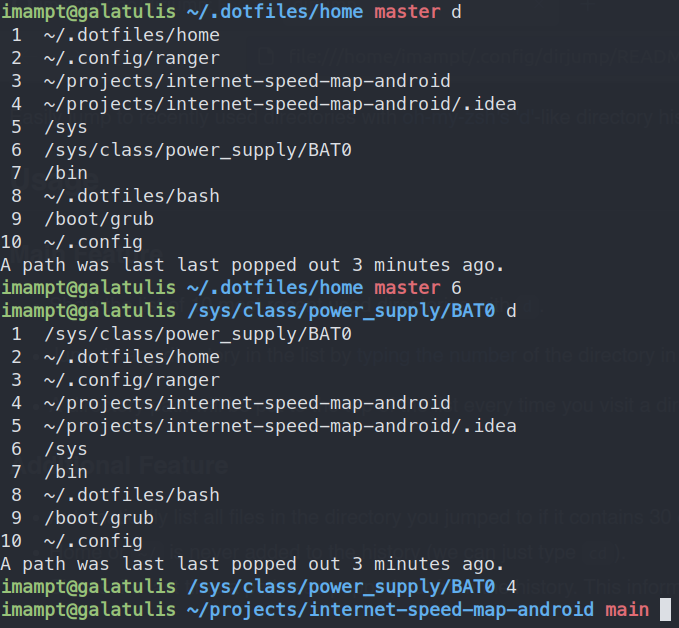

Not maintained anymore. I use [zoxide](https://github.com/ajeetdsouza/zoxide) now.

# dirjump

Easily jump to recently used directories with
[oh-my-zsh's 'd'](https://superuser.com/a/664139/943615)-like directory history
that still saved after exiting the terminal.

## Usage

### Main Feature

- Show the list of 10 most recent used directories with [`d`](#change-the-main-command).
 
- Jump to any directory in the list by [typing the number](#alternative-command-to-jump) of the directory in the list.

- A directory path will be put to the top of the list every time you visit a directory.

### Additional Feature

- Home or `~/` is never added to the history (we can just type `cd`).
- Shows the last time a path was popped out from the history. This information may help you adjust the history size to better suit your need. To change the history size, refer to [this section](#um-only-10)
        
### Screenshot



## Personal Preference

You can modify the code to suit your needs. If you follow the [installation guide](#installation), the script is located in `~/.config/dirjump/dirjump`.

### Change the main command

You can change the main command from `d` to another by modifying [the code](https://github.com/imambungo/dirjump/blob/master/dirjump#L3) below:

```bash
dirjump_command="d"
```

### Alternative command to jump

By default, you can also jump with `<main command> <directory number>`:
```
d 8
```
If you already used any number as aliases, just delete or comment out the code from [line 17 to 22](https://github.com/imambungo/dirjump/blob/master/dirjump#L12).

### Um... only 10??

[There](https://github.com/imambungo/dirjump/blob/master/dirjump#L7) you go.

## Installation

1. Download the script.

        curl --create-dirs -o ~/.config/dirjump/dirjump https://raw.githubusercontent.com/imambungo/dirjump/master/dirjump

2. Source the script to your shell. Don't forget to restart your terminal afterward.

        echo 'source ~/.config/dirjump/dirjump' >> ~/.bashrc

   If you use Zsh:

        echo 'source ~/.config/dirjump/dirjump' >> ~/.zshrc

## Uninstallation

1. Delete the script and the directory history file.

        rm -rf ~/.config/dirjump

2. [Unsource](https://stackoverflow.com/a/5413132/9157799) the script from your shell.

        grep -Fxv "source ~/.config/dirjump/dirjump" ~/.bashrc > temp; mv temp ~/.bashrc

   If you use Zsh:
   
        grep -Fxv "source ~/.config/dirjump/dirjump" ~/.zshrc > temp; mv temp ~/.zshrc
                                                        #####

## Contributing

If you found bugs, typos, wrong grammar, or have any suggestion or question,
feel free to create a new [issue](https://github.com/imambungo/dirjump/issues).
